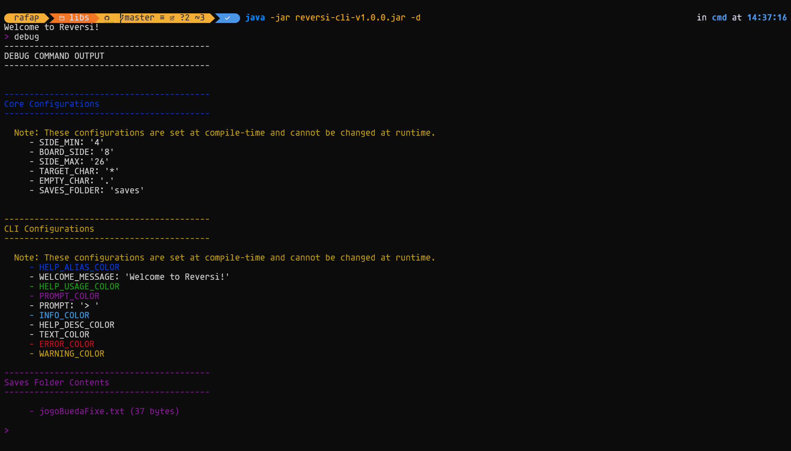

# Reversi Board Game - Kotlin (JVM)

[](https://github.com/isel-leic-tds/32d-2526i-g01-muyloco/actions/workflows/release-tests.yml)

A modular, test-friendly implementation of the Reversi board game written in Kotlin (JVM). The project emphasizes clean
separation of concerns, explicit domain modeling, and pluggable persistence.

## Made By

| Ian Frunze                                                 | Rafael Pereira                                            | Tito Silva                                                     |
|------------------------------------------------------------|-----------------------------------------------------------|----------------------------------------------------------------|
|  |  |  |
| 52867                                                      | 52880                                                     | 53118                                                          |

## Pictures




## Modules

- `reversi-core` — immutable core domain model, game logic and serializers
- `reversi-storage` — simple local filesystem storage implementation (text files)
- `reversi-cli` — small command-line client to play the game
- `reversi-utils` —  utility functions and extensions used by other modules

## Documentation Site

A full HTML version of the generated documentation is available online:  
[Reversi Documentation](https://isel-leic-tds.github.io/32d-2526i-g01-muyloco/)

## Module Structure


## Quick Start

For the CLI version Run:

```bash
./gradlew build
```

Then, run the produced module jar (paths vary depending on build).
To use the debug commands for testing use the `--debug` or `-d` flag:

```bash
java -jar build/libs/reversi-cli-v*.*.*.jar
```


> Note: change `v*.*.*` to the actual version number.

## Project Structure

The project is split in four modules (core, utils, storage and cli). See the `reversi-core`, `reversi-utils`, `reversi-storage` and
`reversi-cli` folders for implementation details and tests.


## Testing

Run the test suite:

```bash
./gradlew test
```

## Documentation

Generate Dokka multi-module HTML:

```bash
./gradlew dokkaHtmlMultiModule
```

Output: `build/dokka/htmlMultiModule/index.html`

For module-level descriptions see the `MODULE.md` files inside each module folder which are also included in the
generated documentation.

## How to play (Rules)

Reversi (also called Othello) is a two-player board game played on an N x N board (normally 8x8).

- Players are identified by pieces: Black (#) and White (@). Each piece has a symbol: '#' or '@'.
- The game starts with four pieces placed in the center in a diagonal pattern (two Black and two White).
- Players alternate turns. On a turn a player must place a piece of their color on an empty square such that one or more of the opponent's contiguous pieces in any of the eight directions (horizontal, vertical, diagonal) are flanked between the newly placed piece and another piece of the current player's color.
- All flanked opponent pieces are flipped to the current player's color.
- If a player has no legal moves, they must pass their turn. If both players have no legal moves, the game ends.
- The winner is the player with more pieces of their color when the game ends. A draw is possible.

This project implements the Reversi rules in `reversi-core`. The CLI (`reversi-cli`) provides an interactive command-line client to create, load, play, and save games using the `reversi-storage` module (text files).

## Playing with the CLI

Start the CLI jar (after building). You can enable debug mode with `--debug` or `-d` to unlock additional developer commands:

```bash
java -jar build/libs/reversi-cli-v*.*.*.jar [--debug]
```

When the CLI starts you'll see a welcome message and a prompt (configurable). The game runs in an interactive read-eval-print loop: type commands and press Enter.

Basic interaction contract:
- Context: the CLI keeps a current `Game` context while you create/join/play.
- Saving: creating or joining a new named game automatically saves the previous named game (if any).
- Commands return human-readable messages and may update the in-memory `Game` state.

### Available commands (summary)

- new (n)
  - Usage: `new (#|@) [<name>]`
  - Creates a new game. The argument is the first player symbol ('#' for Black or '@' for White). Optionally supply a game name to use persistent storage. If no name is given, the game is ephemeral (in-memory only).
  - Examples:
    - `new #` — start a local game where Black (#) starts and the opponent is the opposite color (in-memory).
    - `new @ mymatch` — start a named game saved to disk as `mymatch` with White (@) starting.

- join (j)
  - Usage: `join (<name>) [#|@]`
  - Loads a named saved game from storage. Optionally pass a player symbol to specify which side you control when joining a saved game.
  - Example: `join mymatch @` — open saved game `mymatch` and set you as White (@) if applicable.

- play (p)
  - Usage: `play (row) (col)` or `play (rowcol)` (both integer and letter column formats supported)
  - Makes a move at the given coordinate. The CLI accepts different coordinate formats:
    - Separate row and column: `play 3 4`
    - Combined row+column with a letter: `play 3A` or `play 3a` (letter used as column)
    - Combined digits: `play 34` (row=3, col=4) — only when both characters are digits.
  - Rows and columns are 1-based.
  - Example: `play 4 5` or `play 4A`

- pass
  - Usage: `pass`
  - Skip your turn when you have no legal moves. If the game ends (no player can move), the winner will be reported.

- show (s)
  - Usage: `show`
  - Displays the current board, player scores, current player turn, and (when joined to a named game) the game name and which player is "You".

- refresh (r)
  - Usage: `refresh`
  - Re-reads the underlying game state (useful in multi-process scenarios) and prints the updated board.

- exit
  - Usage: `exit`
  - Exits the CLI. If the current game has a name it will be saved before exit.

Developer / debug-only commands (available with `--debug`):
- debug — extra diagnostics and internal state printing.
- listgames — lists saved game files (helpful during development).

Note: command aliases and colored help text are provided by the CLI parsing library. Use the `usage` shown in the command help to learn more.

## CLI configuration files

Configuration is stored under the `config/` folder. Two important files are created automatically with sensible defaults if missing:

- `config/reversi-cli.properties`
  - Controls the CLI appearance and messages (prompt, colors, welcome message).
  - Relevant keys (defaults shown) — these are read by `reversi-cli`'s `CliConfig`:
    - `WELCOME_MESSAGE` — default: "Welcome to Reversi!"
    - `PROMPT` — default: "> "
    - `PROMPT_COLOR`, `TEXT_COLOR`, `ERROR_COLOR`, `WARNING_COLOR`, `INFO_COLOR`, `HELP_USAGE_COLOR`, `HELP_ALIAS_COLOR`, `HELP_DESC_COLOR` — color names used by the styling library (defaults are ANSI color constants).
  - The CLI writes the default file when it is missing, so you can safely edit the generated `config/reversi-cli.properties` to customize colors and prompt.

- `config/reversi-core.properties`
  - Used by core components; this file is created when the core configuration loader runs. It contains settings that may affect game persistence or other core behaviors. See `reversi-core/src/main/kotlin/pt/isel/reversi/core/CoreConfig.kt` for specific entries and defaults.

The config loader used across the project is `reversi-utils`'s `ConfigLoader`, which creates the file with default keys and loads them into a typed `Config` object.

## Game save file structure (storage format)

Saved games are plain text files stored by `reversi-storage`'s `FileStorage` implementation. Each saved game uses a filename of the form `<name>.txt` and by default is placed in the `saves/` folder. The default folder can be changed via `config/reversi-core.properties` using the key `SAVES_FOLDER` (default: `saves`).

The on-disk format is produced by `reversi-core` serializers; it's line-oriented and human-readable. A saved game file consists of the following parts (in order):

1) Players line (first line)
   - Contains zero or more serialized players separated by `;` and terminated with a newline.
   - Player format: `<symbol>,<points>` (e.g. `#,12` or `@,5`).
   - Example: `#,12;@,5;` (note the trailing separator and ending newline)

2) Last player line (second line)
   - A single character representing the last player's piece symbol (e.g. `#` or `@`) followed by newline.
   - This indicates who performed the most recent move; the next turn belongs to the opposite color.

3) Winner line (third line)
   - If the game has a winner, this line contains the serialized `Player` (same format as players above). If there is no winner yet, this line is empty (just a newline).

4) Board lines (starting at fourth line)
   - The board serializer writes the board as multiple lines. The very first board line is the board side (an integer, e.g. `8` for an 8x8 board).
   - Subsequent lines each encode a single piece in the format: `row,col,symbol`
     - `row` and `col` are integers (1-based coordinates), and `symbol` is the piece symbol (`#` or `@`).
   - Example board section for a small board:
     ```text
     8
     4,4,@
     4,5,#
     5,4,#
     5,5,@
     ```

Putting it all together, a minimal saved game file could look like:

```text
#,2;@,2;
#

8
4,4,@
4,5,#
5,4,#
5,5,@
```

In this example:
- two players (# and @) with 2 points each are recorded on the first line;
- `#` is the last player who moved; the winner line is empty;
- the board is 8x8 and lists the four central pieces.

The serializer and deserializer live in `reversi-core/src/main/kotlin/pt/isel/reversi/core/storage/serializers/`:
- `PlayerSerializer` — serializes `<symbol>,<points>` lines
- `PieceTypeSerializer` — maps piece symbols to enum values and vice versa
- `PieceSerializer` — serializes individual pieces as `row,col,symbol`
- `BoardSerializer` — writes board side then pieces
- `GameStateSerializer` — composes the whole file (players, last player, winner, board)

If a saved file is malformed the core will throw a typed exception (for example `InvalidGameStateInFileException`) providing a helpful error message.

## Where files are created

- Config: `config/reversi-cli.properties` and `config/reversi-core.properties` are created by the `ConfigLoader` when missing.
- Saves: `FileStorage` writes `<name>.txt` files into the `saves/` folder by default (configurable via `config/reversi-core.properties` key `SAVES_FOLDER`).
- Saves folder default: `saves`

## Troubleshooting & tips

- If commands produce `Game is not defined` errors, create or join a game first using `new` or `join`.
- To see the list of saved files (debug mode), start the CLI with `--debug` and run the `listgames` command.
- If colors or prompt look odd on your terminal, edit `config/reversi-cli.properties` and set `PROMPT` and color entries to values supported by your terminal.
- Saved game files are human-readable; you can inspect them directly to debug persistence issues.
