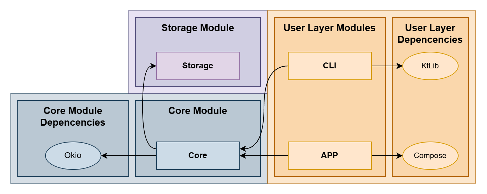

# Reversi Board Game - Kotlin (JVM)

A modular, test-friendly implementation of the Reversi board game written in Kotlin (JVM). The project emphasizes clean
separation of concerns, explicit domain modeling, and pluggable persistence.


## Contents

- Core immutable board & piece model
- Game abstraction (players, logic extension points)
- Local filesystem persistence (text format) via `LocalGDA`
- CLI shell with commands (start, join, move, pass, help, quit)
- Structured result codes for persistence feedback
- Unit tests (board and data access layer)
- Generated documentation (Dokka) with curated package overviews

## Project Structure


## Quick Start

```bash
# Build (includes fat JAR and docs)
./gradlew build

# Run (fat jar contains dependencies)
java -jar build/libs/Reversi-0.0.1-all.jar --cli
```

On Windows (cmd):

```cmd
gradlew.bat build
java -jar build\libs\Reversi-0.0.1-all.jar
```

## Architecture Overview

| Package                              | Responsibility                                                   |
|--------------------------------------|------------------------------------------------------------------|
| `pt.isel.reversi.core.board`         | Board, coordinates, piece types & safe transformation operations |
| `pt.isel.reversi.core.game`          | Game interfaces, player representation, logic contracts          |
| `pt.isel.reversi.core.game.localgda` | Concrete local text-file persistence (`LocalGDA`)                |
| `pt.isel.reversi.cli`                | CLI loop & rendering utilities                                   |
| `pt.isel.reversi.cli.commands`       | Discrete command handlers for user actions                       |





For in-depth narrative descriptions see `Module.md` (also surfaced in generated Dokka docs).

## Local Persistence (GameFileStorage)

TODO: Add description of the text format and usage examples.

## Testing

Run the test suite:

```bash
./gradlew test
```
TODO: Add instructions for running specific test classes or packages if needed.
## Documentation

Generate updated docs:

```bash
./gradlew dokkaHtmlMultiModule
```

Output: `build/dokka/htmlMultiModule/index.html`

## Design Principles Recap

- **Legibility**: The code should be clear and self-explanatory.
- **Organization**: Clear separation between the model (logic and data) and the user interface.
- **Modularity**: Each module should have a single responsibility.
- **Ease of modification**: For example, allow adjusting the board size and the symbol assigned to each player without major code changes.
- **Reuse**: In particular, the entire game model should be reusable in the next phase.
- **Immutability**: There should be only one variable holding the game state.
- **Consistency**: Do not allow the representation of invalid states.
- **No duplication**: The same idea should not be implemented in multiple places.
- **Robustness**: Proper handling of errors, invalid inputs, and incorrect states.
- **Functional correctness**: Strict compliance with the requirements.

## Acknowledgements
This project was developed as part of the Software Development Techniques course at ISEL (Instituto Superior de Engenharia de Lisboa). Special thanks to our instructor Paulo Pereira. We recommend watching his lectures on software architecture and design principles for those interested in learning more about these topics, and his videos on Kotlin for JVM development. You can find his channel [here](https://www.youtube.com/@ProfPauloPereira).
We also acknowledge the use of the storage design pattern inspired by his SlidingPuzzle implementation and from an older project developed during the Software Architecture course at ISEL made by [roby2014](https://github.com/roby2014/uni-projects/).