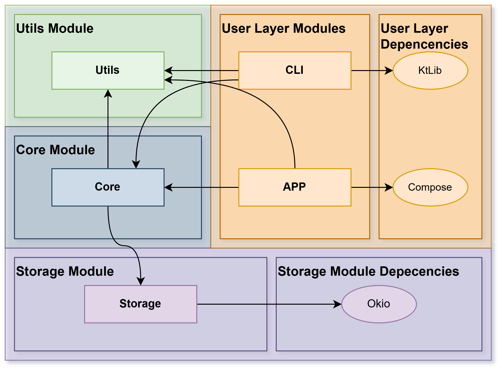
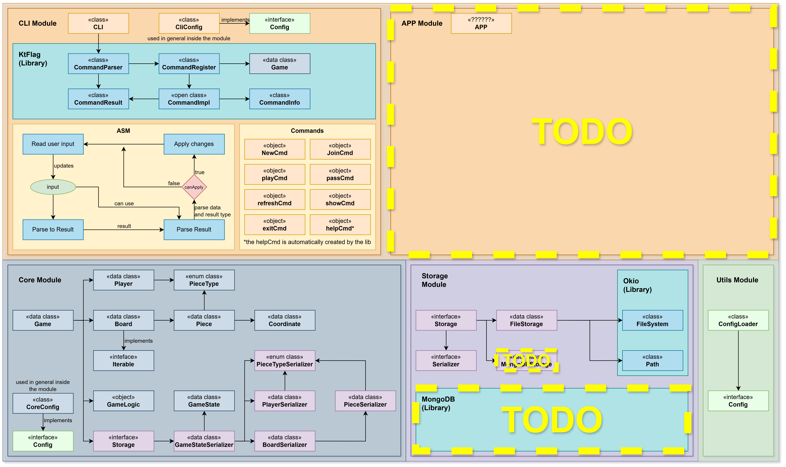

# Reversi Board Game - Kotlin (JVM)

[](https://github.com/isel-leic-tds/32d-2526i-g01-muyloco/actions/workflows/release-tests.yml)


A modular, test-friendly implementation of the Reversi board game written in Kotlin (JVM). The project emphasizes clean
separation of concerns, explicit domain modeling, and pluggable persistence.


## Modules
- `reversi-core` — immutable core domain model, game logic and serializers
- `reversi-storage` — simple local filesystem storage implementation (text files)
- `reversi-cli` — small command-line client to play the game

## Documentation Site

A full HTML version of the generated documentation is available online:  
[Reversi Documentation](https://isel-leic-tds.github.io/32d-2526i-g01-muyloco/)

## Module Structure



## Quick Start

For the CLI version Run:

```bash
./gradlew reversiCliJar
```

Then, run the produced module jar (paths vary depending on build):

```bash
java -jar build/libs/reversi-cli-v*.*.*.jar
```

> Note: change `v*.*.*` to the actual version number.

## Project Structure

The project is split in three modules (core, storage and cli). See the `reversi-core`, `reversi-storage` and
`reversi-cli` folders for implementation details and tests.



## Testing

Run the test suite:

```bash
./gradlew test
```

## Documentation

Generate Dokka multi-module HTML:

```bash
./gradlew dokkaHtmlMultiModule
```

Output: `build/dokka/htmlMultiModule/index.html`

For module-level descriptions see the `MODULE.md` files inside each module folder which are also included in the
generated documentation.
