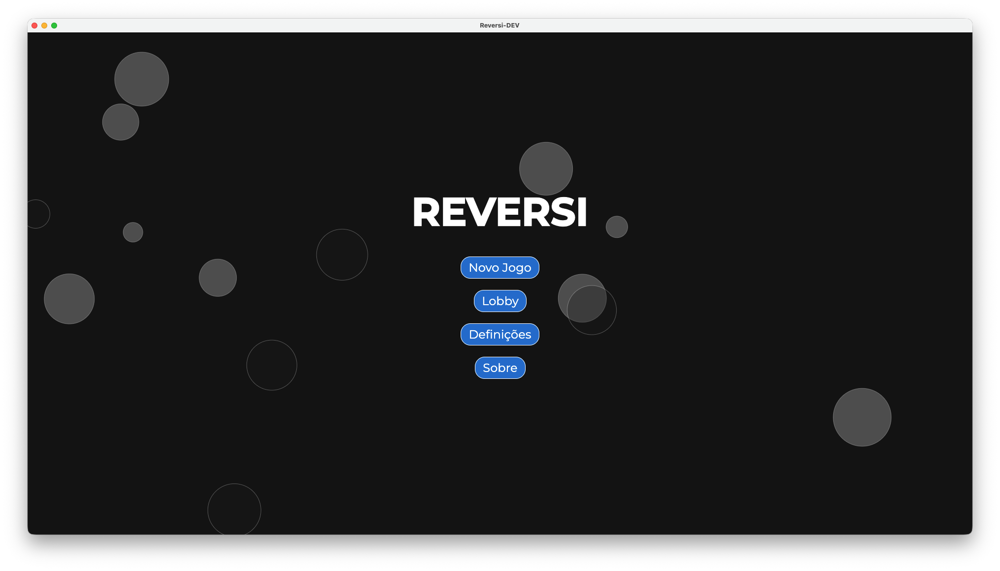
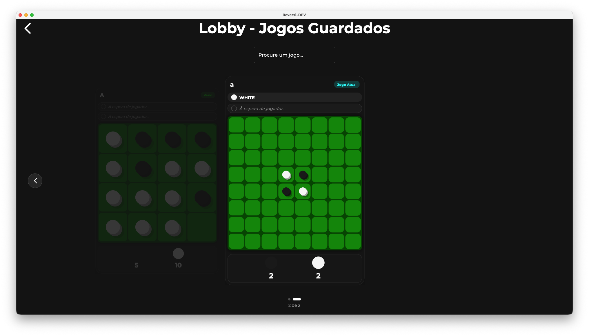
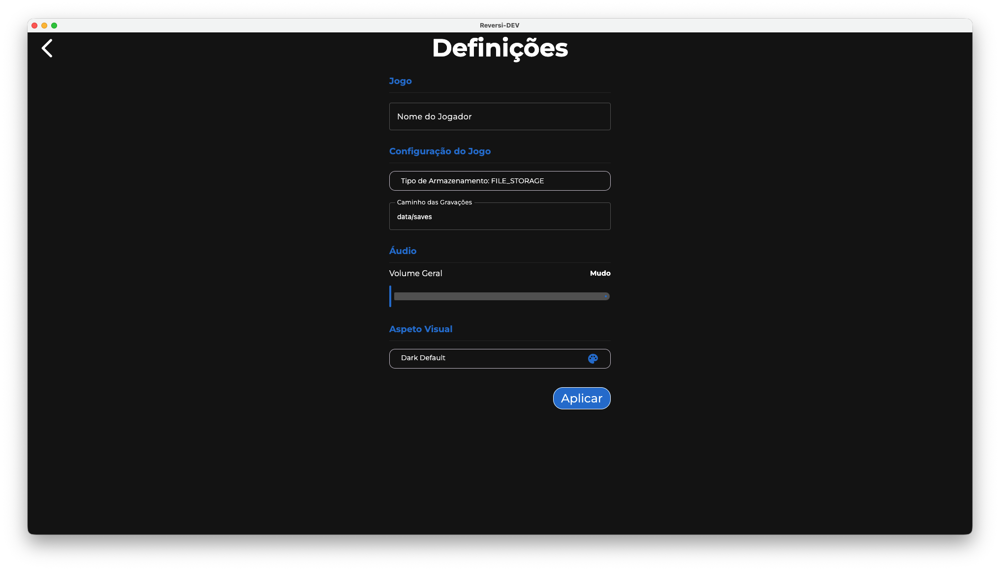
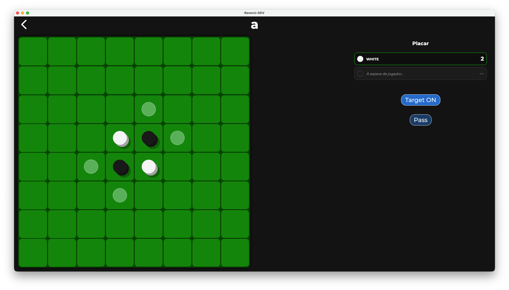

# Reversi Board Game - Kotlin (JVM)

[](https://github.com/RafaPear/TDS-2425-Assignment/actions/workflows/release-tests.yml)

A modular, test-friendly implementation of the Reversi board game written in Kotlin (JVM) targeting **Java 21**. 
The project emphasizes clean separation of concerns, explicit domain modeling, and pluggable persistence.

**Requirements:**
- Java 21 or later
- Gradle 8.0 or later

## Made By

| Ian Frunze                                                 | Rafael Pereira                                            | Tito Silva                                                     |
|------------------------------------------------------------|-----------------------------------------------------------|----------------------------------------------------------------|
|  |  |  |
| 52867                                                      | 52880                                                     | 53118                                                          |

## Technology Stack

| Component                     | Version |
|-------------------------------|---------|
| **Java**                      | **21**  |
| **Kotlin**                    | 2.2.20  |
| **Gradle**                    | 8.0+    |
| **Compose (Desktop)**         | 1.9.1   |
| **Coroutines**                | 1.10.2  |
| **MongoDB Driver** (optional) | 5.6.1   |

## Pictures

<table>
<tr>
<td width="50%" align="center">

</td>
<td width="50%" align="center">

</td>
</tr>
<tr>
<td width="50%" align="center">

</td>
<td width="50%" align="center">

</td>
</tr>
<tr>
<td width="50%" align="center">

</td>
<td width="50%" align="center">

</td>
</tr>
</table>

## Project Modules

The project is organized into five specialized, independently testable modules:

- **`reversi-core`** — Immutable core domain model, game logic and serializers
    - Implements the Reversi game rules (move validation, piece capture, board management)
    - Pure functional domain logic with no I/O or UI concerns
    - Defines types and serializers for persistence
    - Comprehensive test coverage for all game rules
    - See [reversi-core/MODULE.md](reversi-core/MODULE.md) for architecture details

- **`reversi-storage`** — Simple local filesystem storage implementation
    - Provides file-based persistence for game snapshots using the generic `Storage<K,T,U>` contract
    - Supports human-readable `.txt` files for easy debugging and manual inspection
    - Optional MongoDB support for scalable server deployments
    - Fully decoupled from serialization logic
    - See [reversi-storage/MODULE.md](reversi-storage/MODULE.md) for architecture details

- **`reversi-utils`** — Utility functions and extensions
    - Configuration loading and management via `ConfigLoader` pattern
    - Environment constants and shared helper functions
    - Used by other modules for common concerns
    - See [reversi-utils/MODULE.md](reversi-utils/MODULE.md) for architecture details

- **`reversi-cli`** — Interactive command-line interface client
    - REPL-based gameplay with multiple command implementations
    - Command framework using KtFlag library for elegant parsing
    - Color-coded output and configurable prompts
    - Full game lifecycle: create, join, play, save, exit
    - Debug mode for developer testing
    - See [reversi-cli/MODULE.md](reversi-cli/MODULE.md) for architecture details

- **`reversi-app`** — Desktop GUI application (Jetpack Compose for Desktop)
    - Modern, responsive user interface for gameplay
    - State management with ViewModel pattern
    - Rich visual feedback and interactive board rendering
    - Supports game persistence and multiple players
    - See [reversi-app/MODULE.md](reversi-app/MODULE.md) for architecture details

## Documentation Site

A full HTML version of the generated documentation is available online:  
[Reversi Documentation](https://isel-leic-tds.github.io/32d-2526i-g01-muyloco/)

## Module Structure


## Quick Start

### Prerequisites

- **Java 21** (verify with `java -version`)
- Gradle 8.0+ (or use the included `./gradlew`)

### Building and Running

```bash
./gradlew build
```

Then, run the CLI module jar:

```bash
java -jar build/libs/reversi-cli-2.0.0.jar
```

To use debug commands for testing, add the `--debug` or `-d` flag:

```bash
java -jar build/libs/reversi-cli-2.0.0.jar --debug
```

> Note: Replace version number `2.0.0` with the actual version from the build output if different.

## Project Structure

The project is split in four modules (core, utils, storage and cli). See the `reversi-core`, `reversi-utils`,
`reversi-storage` and
`reversi-cli` folders for implementation details and tests.


## Testing

Run the complete test suite:

```bash
./gradlew test
```

Run tests for a specific module:

```bash
./gradlew :reversi-core:test
```

The project emphasizes comprehensive test coverage, particularly for the `reversi-core` module which contains all game logic.

## Documentation

### Generate Documentation

Generate Dokka multi-module HTML documentation:

```bash
./gradlew dokkaHtmlMultiModule
```

Output: `build/dokka/htmlMultiModule/index.html`

### Online Documentation

A full HTML version of the generated documentation is available online:  
[Reversi Documentation](https://isel-leic-tds.github.io/32d-2526i-g01-muyloco/)

### Module Documentation

For module-level architecture and design details, see the `MODULE.md` files inside each module folder. These are also included in the generated Dokka documentation.

## How to Play (Rules)

Reversi (also known as Othello) is a classic two-player board game played on an N × N board (traditionally 8×8).

### Game Overview

- **Players**: Two players using different colored pieces
  - **Black** (#) and **White** (@) pieces
- **Board**: N × N grid (default 8×8)
- **Setup**: Four pieces placed in the center in a diagonal pattern (two Black, two White)

### Game Rules

1. **Placement**: Players alternate turns, placing a piece of their color on an empty square
2. **Capture**: A piece can only be placed if it flanks one or more opponent pieces in any of the eight directions (horizontal, vertical, diagonal) between the newly placed piece and another piece of the same color
3. **Flipping**: All flanked opponent pieces are immediately flipped to the current player's color
4. **Passing**: If a player has no legal moves, they must pass their turn
5. **Game End**: When both players have no legal moves, the game ends
6. **Winning**: The player with more pieces of their color wins. Draws are possible.

### Implementation

- **`reversi-core`** module implements the complete Reversi game logic and rules validation
- **`reversi-cli`** provides an interactive command-line interface for gameplay
- **`reversi-storage`** handles saving and loading games to/from disk

## Playing with the CLI

Start the CLI jar (after building with `./gradlew build`):

```bash
java -jar build/libs/reversi-cli-2.0.0.jar [--debug]
```

Optionally enable debug mode with `--debug` or `-d` flag to unlock additional developer commands.

### CLI Interaction Model

When the CLI starts you'll see a welcome message and a prompt (configurable). The game runs in an interactive read-eval-print loop: type commands and press Enter.

**Context & Persistence:**
- The CLI maintains a current `Game` context during your session
- Creating or joining a named game automatically saves the previous game (if any)
- Commands return human-readable messages and may update the in-memory state
- All named games are persisted to disk in the `saves/` folder

### Available Commands (Summary)

#### Game Management Commands

- **new (n)**
    - Usage: `new (#|@) [<name>]`
    - Creates a new game. The argument is the first player symbol ('#' for Black or '@' for White). Optionally supply a
      game name to use persistent storage. If no name is given, the game is ephemeral (in-memory only).
    - Examples:
        - `new #` — start a local game where Black (#) starts and the opponent is the opposite color (in-memory).
        - `new @ mygame` — start a named game saved to disk as `mygame` with White (@) starting.

- **join (j)**
    - Usage: `join <name> [#|@]`
    - Loads a named saved game from storage. Optionally pass a player symbol to specify which side you control when
      joining a saved game.
    - Example: `join mygame @` — open saved game `mygame` and set you as White (@) if applicable.

#### Gameplay Commands

- **play (p)**
    - Usage: `play (row) (col)` or `play (rowcol)` (both integer and letter column formats supported)
    - Makes a move at the given coordinate. The CLI accepts different coordinate formats:
        - Separate row and column: `play 3 4`
        - Combined row+column with a letter: `play 3A` or `play 3a` (letter used as column)
        - Combined digits: `play 34` (row=3, col=4) — only when both characters are digits.
    - Rows and columns are 1-based.
    - Example: `play 4 5` or `play 4A`

- **pass**
    - Usage: `pass`
    - Skip your turn when you have no legal moves. If the game ends (no player can move), the winner will be reported.

- **show (s)**
    - Usage: `show`
    - Displays the current board, player scores, current player turn, and (when joined to a named game) the game name
      and which player is "You".

- **refresh (r)**
    - Usage: `refresh`
    - Re-reads the underlying game state (useful in multi-process scenarios) and prints the updated board.

#### Session Commands

- **exit**
    - Usage: `exit`
    - Exits the CLI. If the current game has a name it will be saved before exit.

#### Developer Commands (available with `--debug`)

- **debug** — Print internal state and extra diagnostics for troubleshooting
- **listgames** — List all saved game files in the saves folder

> **Note**: Command aliases and colored help text are provided by the CLI parsing library. Use `help <command>` for more details on any command.

## CLI Configuration

Configuration files are stored in the `config/` folder and are created automatically with sensible defaults if missing.

### reversi-cli.properties

Controls the CLI appearance and behavior:

**Display Settings:**
- `PROMPT` — Command prompt (default: `"> "`)
- `WELCOME_MESSAGE` — Startup greeting (default: `"Welcome to Reversi!"`)

**Color Settings** — Uses standard ANSI color names
- `PROMPT_COLOR`, `TEXT_COLOR`, `ERROR_COLOR`, `WARNING_COLOR`, `INFO_COLOR`
- `HELP_USAGE_COLOR`, `HELP_ALIAS_COLOR`, `HELP_DESC_COLOR`

You can safely edit the generated file to customize colors, prompts, and messages.

### reversi-core.properties

Contains core configuration affecting game logic and persistence:
- `savesPath` — Directory for saved games (default: `"saves"`)

See `reversi-core/src/main/kotlin/pt/isel/reversi/core/CoreConfig.kt` for all available options.

### Configuration System

Configuration is managed by `reversi-utils`'s `ConfigLoader`, which:
- Creates files with default values if missing
- Loads settings into typed `Config` objects
- Supports runtime configuration changes

## Game Save File Structure (Storage Format)

Saved games are plain text files stored by `reversi-storage`'s `FileStorage` implementation. Each saved game uses a
filename of the form `<name>.txt` and by default is placed in the `saves/` folder. The default folder can be changed via
`config/reversi-core.properties` using the key `savesPath` (default: `"saves"`).

The format is line-oriented and human-readable, produced by serializers in `reversi-core`. A saved game file consists of:

**Line 1 — Players** 
- Serialized players separated by `;`, terminated with newline
- Format: `<symbol>,<points>` (e.g., `#,12;@,5;`)

**Line 2 — Last Player**
- Single character: `#` or `@` indicating who played last
- Next turn belongs to the opposite color

**Line 3 — Winner**
- If game ended: serialized winner in same format as players
- If ongoing: empty line (just newline)

**Lines 4+ — Board**
- First board line: integer (board size, e.g., `8` for 8×8)
- Following lines: each piece as `row,col,symbol` (1-based coordinates)

**Example saved game:**

```text
#,2;@,2;
#

8
4,4,@
4,5,#
5,4,#
5,5,@
```

This represents a game where:
- Players are Black (#) and White (@), each with 2 points
- Black played last; winner line is empty (game ongoing)
- Board is 8×8 with the four central pieces shown

### Serializers

Serialization logic lives in `reversi-core/src/main/kotlin/pt/isel/reversi/core/storage/serializers/`:

- `GameStateSerializer` — Entire game state (players, last player, winner, board)
- `BoardSerializer` — Board and all pieces  
- `PlayerSerializer` — Individual player data
- `PieceSerializer` — Individual pieces as `row,col,symbol`
- `PieceTypeSerializer` — Piece symbols (#, @) ↔ enum values

### Error Handling

Malformed save files throw typed exceptions from the core (e.g., `InvalidGameStateInFileException`) with helpful error messages.

## File Locations

| Component | Location | Default |
|-----------|----------|---------|
| CLI Config | `config/reversi-cli.properties` | Auto-created |
| Core Config | `config/reversi-core.properties` | Auto-created |
| Saved Games | `saves/` | Configurable via `savesPath` |

## Troubleshooting

**"Game is not defined" errors**
- Create or join a game first: `new #` or `join <name>`

**Can't find saved games**
- Enable debug mode: `--debug` flag
- Use `listgames` command to list all saved games

**Colors or display issues**
- Edit `config/reversi-cli.properties` to use terminal-compatible ANSI color names
- Check [ANSI color documentation](https://en.wikipedia.org/wiki/ANSI_escape_code#8-bit) for supported values

**Corrupted save file**
- Delete the problematic `.txt` file from the `saves/` folder
- Start a new game or load a backup

**Performance or I/O issues**  
- Ensure write permissions in `config/` and `saves/` directories
- Check available disk space
- Try restarting the application
