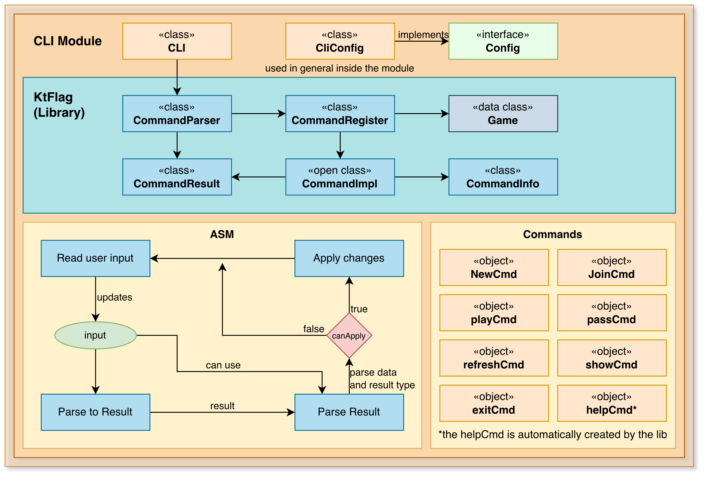

Module reversi-app

## Overview

A modern desktop GUI application for playing Reversi using Jetpack Compose for Desktop. This module provides a rich,
interactive user experience while maintaining clean separation from the core game logic and storage systems. The app
follows MVVM (Model-View-ViewModel) architecture with reactive state management for responsive, testable code.

The module builds upon the immutable core domain model and storage layer, providing a layer of UI logic and user
interaction management. All game rules and state are delegated to the core module, keeping the app lightweight and
focused on presentation.

## Architecture

The app is organized into layers:

- **Main Entry Point** — Application initialization and window setup
- **UI Pages/Screens** — Individual game screens and menus
- **ViewModels** — State management and business logic coordination
- **UI Components** — Reusable Compose components
- **Configuration** — App-specific settings and theming

### MVVM Pattern

**ViewModel Layer:**
- Manages state for each screen
- Coordinates between UI and core logic
- Handles user input (moves, commands)
- Manages coroutines for async operations
- Exposes state as observable flows

**View Layer (Compose):**
- Renders UI based on ViewModel state
- Sends user events to ViewModel
- Handles animations and transitions
- Provides visual feedback

**Model Layer (Core):**
- Immutable Game and GameState objects
- Pure game logic (via core module)
- Persistence (via storage module)

## Key Components

### Main Application
The entry point that:
1. Initializes configuration
2. Creates the main window
3. Sets up theming and styling
4. Launches the root composable
5. Manages application lifecycle

### Pages/Screens

#### Menu Screen
- New Game creation
- Load Game selection
- Settings
- Exit

#### Game Screen
- Interactive board display
- Piece rendering with colors
- Legal move highlighting
- Player scores
- Game state display
- Move submission
- Pass button
- Game menu

#### Game Over Screen
- Winner announcement
- Final scores
- Play Again option
- Menu option

### ViewModels

Each screen has a corresponding ViewModel:

**MenuViewModel:**
- Available games list
- New game parameters
- Navigation state

**GameViewModel:**
- Current game state
- Board representation
- Available moves
- Player information
- Move execution coordination

**GameOverViewModel:**
- Winner determination
- Final statistics
- Return to menu

### Composable Components

**Board Display:**
- Grid layout for 8x8 board
- Piece rendering with symbols/colors
- Legal move highlighting
- Clickable squares for move input
- Animations for piece placement

**Player Info:**
- Current player indicator
- Score display
- Piece color indicators
- Turn status

**Buttons and Controls:**
- Move buttons
- Pass button
- Game menu button
- New Game button
- Load Game button

## User Experience

### Visual Feedback
- Board highlights legal moves
- Pieces animated when placed
- Colors distinguish Black and White
- Turn indicator shows who plays next
- Score updates in real-time

### Game Flow
1. Start app → See main menu
2. Create new game or load saved game
3. View board with current player highlighted
4. Click square to play move
5. Move executes with animation
6. Board updates with captured pieces
7. Turn passes to other player
8. Repeat until game ends
9. See final score and results
10. Return to menu to play again

### Save/Load
- Current game auto-saves to storage
- Can resume interrupted games
- Load screen shows all saved games
- Delete games from UI

## Reactive State Management

Uses Kotlin Flow for reactive updates:
- Board state flows to UI
- Player scores flow to UI
- Available moves flow to UI
- Game over state flows to UI
- All updates are immutable and predictable

Benefits:
- UI automatically updates when state changes
- Testable state transformations
- No callback hell
- Easy to implement undo/redo
- Easy to implement multiplayer

## Configuration

Reads from `reversi-app.properties`:
- Theme settings (colors, fonts)
- Animation speeds
- Board display options
- Default game parameters
- Audio settings
- Accessibility options

## Integration

The app integrates with:
- **reversi-core** — Game logic and types
- **reversi-storage** — Save/load functionality
- **reversi-utils** — Configuration and logging
- **Jetpack Compose** — UI framework
- **Kotlin Coroutines** — Async operations

## Advantages Over CLI

- **Visual Board** — Much easier to understand board state
- **Click Interface** — Faster than typing coordinates
- **Live Feedback** — Immediate visual response
- **Animation** — Shows piece captures visually
- **Save/Load UI** — Browse saved games
- **Multi-player Friendly** — Can rotate device for hotseat play
- **Modern Look** — Attractive, native desktop appearance

## Design Principles

1. **Separation of Concerns** — UI, logic, and persistence are separate
2. **Immutability** — State is immutable; changes create new objects
3. **Reactivity** — UI automatically responds to state changes
4. **Testability** — ViewModels can be tested without UI
5. **Responsiveness** — Heavy operations run in background coroutines
6. **Reusability** — Components can be used in multiple screens
7. **Composability** — Large screens built from small components

## Testing

**Unit Tests:**
- ViewModel logic without UI
- State transitions
- Move validation
- Configuration loading

**UI Tests (Future):**
- Component rendering
- User interaction
- Visual regression
- Accessibility

**Integration Tests:**
- Full game flow
- Save/load round-trips
- Config persistence

## Future Enhancements

Potential improvements:
- Network multiplayer (play against remote opponent)
- AI opponent using minimax or neural network
- Game statistics and analytics
- Elo rating system
- Game replay and analysis tools
- Custom board sizes
- Themes and customization
- Sound effects and music
- Undo/redo during gameplay
- Move suggestions/hints

#Package pt.isel.reversi.app

#Package pt.isel.reversi.app

## Overview

Hosts the main application entry point and desktop GUI components. The application integrates with the core game
logic and storage system while providing a rich user interface for playing Reversi.

### Key Classes

- `Main` — Application entry point and window setup
- Game UI Components — Interactive board rendering and move handling
- State Management — ViewModel-based state management for game session

### Responsibilities

- Providing an interactive desktop GUI for the Reversi game
- Managing UI state and user interactions
- Coordinating with the core game logic and storage modules
- Handling player input and rendering the game board
