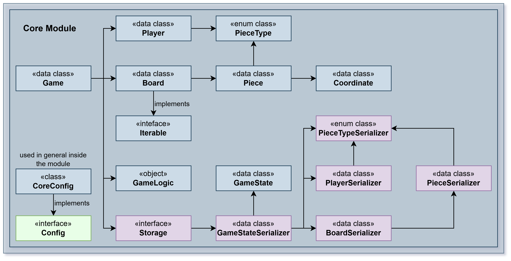

Module reversi-core

This module contains the immutable core domain model and game logic for the Reversi game. It is UI‑agnostic and
persistence‑agnostic and exposes plain Kotlin data types and pure functions that implement the rules of the game.

#Package pt.isel.reversi.core

## Overview

Provides the main game types and coordination layer. The module contains small, focused components that model the
board, pieces, players and the game orchestration. It is intentionally free of any I/O concerns so it can be used by
CLI, GUI or test code without modification.

### Key classes

- Game — lightweight, immutable carrier for a game session. Orchestrates moves, passes and state transitions.
- GameLogic — pure logic that validates moves, computes captures and available plays.
- Player — represents a player and provides helper methods to refresh points and swap piece type.

### Responsibilities

- Representing the board, pieces, coordinates and piece types as immutable data types
- Enforcing move validation and piece capture rules (Reversi)
- Providing deterministic, testable transformations that return new board/game instances
- Defining small storage-friendly DTOs (GameState) used by the storage module

#Package pt.isel.reversi.core.board

## Overview

Contains the board model and related primitives used to represent the game grid and pieces.

### Notable types

- Board — immutable board representation with safe transformation methods (add/change pieces, iterate pieces)
- Coordinate — row/column pair with helper arithmetic and boundary checks
- Piece / PieceType — piece value and utilities (symbols, swaps)

### Responsibilities

- Coordinate and bounds validation
- Legal move evaluation and piece flipping helpers (used by GameLogic)
- Producing the initial board setup and iterating existing pieces

#Package pt.isel.reversi.core.storage

## Overview

Lightweight DTO used to persist/restore games produced by the core module. Serializers living under
`core.storage.serializers` convert core types to/from a compact text format used by the storage module.

#Package pt.isel.reversi.core.exceptions

## Overview

Domain-specific exceptions that signal invalid operations or corrupted persisted files (for example: malformed
board or piece entries). These exceptions are thrown by the core logic or by the serializers when encountering
invalid data.

### Examples

- InvalidPlayException — thrown when attempting to play an invalid move
- InvalidGameException — thrown when game operations are invoked on an unstarted game
- InvalidPieceInFileException / InvalidSideInFileException — thrown when a persisted file is malformed
