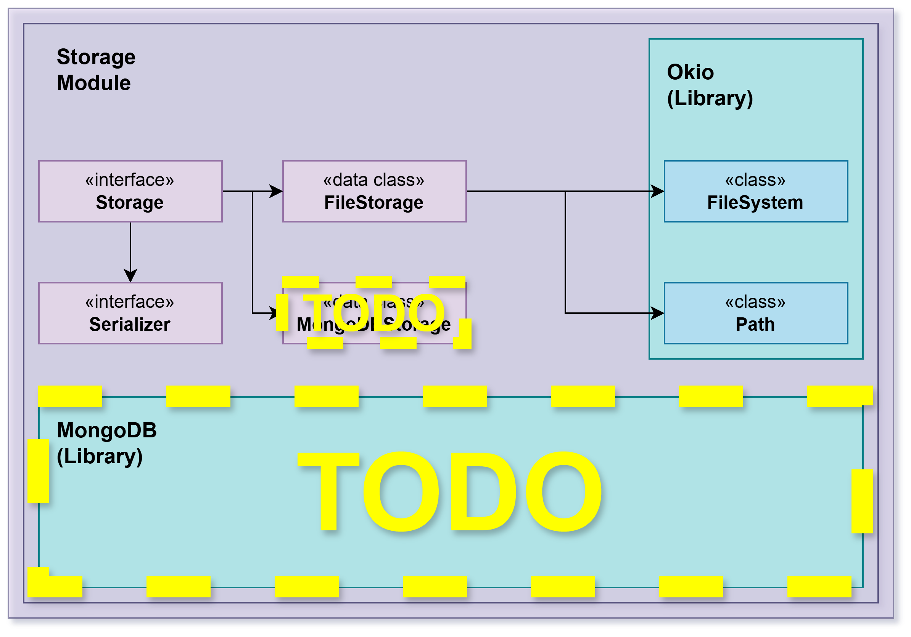

Module reversi-storage

This module implements simple local filesystem persistence for game snapshots used by the core model. It provides
an implementation of the generic `Storage<K,T,U>` contract (`FileStorage`) together with text-based serializers for
core types (board, piece, players and game state).

#Package pt.isel.reversi.storage

## Overview

Implements persistence using plain text files placed in a `saves` folder by default. The storage code is intentionally
simple: domain objects are converted to a textual representation via `Serializer` implementations and written to files.
This approach favors human-readable saves that are easy to debug and test.

### Responsibilities

- Reading and writing game snapshots to local text files (FileStorage)
- Providing `Serializer` implementations to (de)serialize domain types to strings
- Validating file structure and reporting errors when the persisted data is malformed

### Notes

- The concrete serializers for core types live in `reversi-core` under `core.storage.serializers` and are composed by
  `FileStorage` through the `Storage` contract.
- Default folder used by the project is `saves` (see `Environment.kt` in core).
