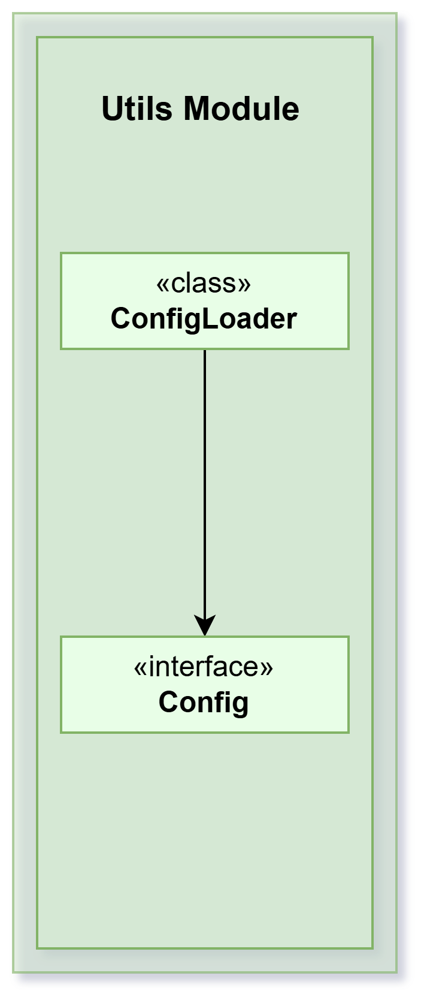

Module reversi-utils

## Overview

Provides reusable utilities and shared infrastructure used by all other Reversi modules (core, cli, storage, app).
This module contains configuration management, environment constants, logging setup, and helper functions that
promote code reuse and consistency across the project.

The module is intentionally minimal to avoid dependencies that would couple other modules. It provides only the
essential cross-cutting concerns that multiple modules need.



## Architecture

The module is organized into:

- **Configuration Management** — ConfigLoader and Config interface
- **Environment Constants** — Centralized path and folder definitions
- **Logging Infrastructure** — Global logger setup
- **Audio Utilities** — Sound system for game feedback (optional)
- **Helper Functions** — Extension functions and utilities

## Configuration Management

### ConfigLoader<U : Config>
A generic configuration loader that:
1. Reads Java properties files
2. Auto-creates missing files with default values
3. Adds missing keys on each run
4. Converts properties to typed Config objects
5. Persists configuration back to disk

**Process:**
- On first run: Creates file and writes default values from `getDefaultConfigFileEntries()`
- On subsequent runs: Reads file, adds any missing keys with defaults, updates file
- Returns a fully populated Config object

**Example:**
```kotlin
val loader = ConfigLoader("config/myapp.properties") { props ->
    MyConfig(props)
}
val config = loader.loadConfig()
```

### Config Interface
Implemented by modules to define their configuration:
- `map: Map<String, String>` — All configuration properties
- `getDefaultConfigFileEntries(): Map<String, String>` — Default values to use when keys are missing

**Examples:**
- `CoreConfig` (reversi-core) — Game logic configuration
- `CliConfig` (reversi-cli) — CLI appearance (colors, prompt)

Each module can independently define and manage its configuration.

## Environment Constants

### Directory Structure
```
data/
├── config/
│   ├── reversi-core.properties
│   ├── reversi-cli.properties
│   └── reversi-app.properties
├── crash/
│   └── REVERSI-CRASH-{date}.log
├── logs/
│   └── reversi-app-{date}.log
└── saves/
    ├── game1.txt
    ├── game2.txt
    └── ...
```

### Constants
- `BASE_FOLDER = "data"` — Root directory for application data
- `CONFIG_FOLDER = "data/config"` — All configuration files
- `CORE_CONFIG_FILE = "data/config/reversi-core.properties"` — Core configuration
- `CLI_CONFIG_FILE = "data/config/reversi-cli.properties"` — CLI configuration
- `APP_CONFIG_FILE = "data/config/reversi-app.properties"` — App configuration
- `BASE_LOG_FILE_NAME = "logs/reversi-app"` — Log file prefix

These centralized constants prevent hardcoding paths throughout the codebase.

## Logging Infrastructure

### Global Logger
```kotlin
val LOGGER: Logger = Logger.getGlobal().apply {
    useParentHandlers = false
    level = Level.ALL
    addHandler(StdOutConsoleHandler().apply {
        level = Level.ALL
        formatter = PlainFormatter()
    })
}
```

**Features:**
- Configured with `StdOutConsoleHandler` for console output
- Uses `PlainFormatter` for simple, readable format
- All log levels are captured (Level.ALL)
- Used throughout the application for consistent logging

**Usage:**
```kotlin
LOGGER.info("Game started: $gameName")
LOGGER.warning("Invalid move attempted")
LOGGER.severe("Failed to load configuration")
```

## Logging Components

### PlainFormatter
Formats log messages in plain text:
- No complex metadata
- Human-readable timestamps
- Clear level indicators
- Compact output suitable for console

### StdOutConsoleHandler
Outputs log records to standard output:
- Writes to System.out
- Captures all levels from configured logger

## Audio System (Optional)

### AudioWrapper
Manages sound playback:
- Loads audio files
- Controls volume
- Plays sounds during gameplay

### AudioModifier
Modifies audio properties:
- Pitch adjustment
- Volume control
- Playback speed

### Audio Controls
- `BooleanControlWrapper` — On/off controls
- `FloatControlWrapper` — Continuous controls (volume, pitch)

These allow the application to provide audio feedback without forcing the feature on users.

## Helper Functions and Extensions

### Utility Functions
- `makePathString()` — Constructs file paths with proper separators
- Extension functions for common operations
- String formatting utilities

These small helpers promote consistency and reduce boilerplate.

## Design Principles

1. **Minimal Dependencies** — Only essential cross-cutting concerns
2. **No Dependency Cycles** — Can be used without importing other modules
3. **Convention Over Configuration** — Sensible defaults for standard paths
4. **Extensible** — New modules can provide their own Config implementations
5. **Separation of Concerns** — Configuration, logging, and utilities are independent
6. **Type Safety** — Strongly typed Config implementations

## Usage Patterns

### Using Configuration in a Module

1. Create Config implementation:
```kotlin
class MyModuleConfig(override val map: Map<String, String>) : Config {
    val myValue = map["myKey"] ?: "default"
    
    override fun getDefaultConfigFileEntries() = mapOf(
        "myKey" to "default"
    )
}
```

2. Load configuration:
```kotlin
val loader = ConfigLoader("data/config/mymodule.properties") { props ->
    MyModuleConfig(props)
}
val config = loader.loadConfig()
```

### Logging from Any Module

```kotlin
LOGGER.info("Something happened")
LOGGER.warning("Watch out!")
LOGGER.severe("Error occurred")
```

### Using Constants

```kotlin
val configPath = File(CONFIG_FOLDER)
val logFile = File(BASE_LOG_FILE_NAME)
```

## Integration

The utils module is used by:
- **reversi-core** — Configuration loading for game logic
- **reversi-cli** — CLI configuration and logging
- **reversi-storage** — Path constants and utilities
- **reversi-app** — All utilities and configuration

The utils module has NO dependencies on other modules (except Kotlin stdlib),
making it safe to use anywhere without creating circular dependencies.

#Package pt.isel.reversi.utils

## Overview

This package contains reusable utilities that support configuration handling.
The central feature is a `ConfigLoader` class that automates the creation and loading of configuration files in
`.properties` format, allowing each subsystem to define its own configuration model by implementing the `Config`
interface.
This ensures that each module can provide default configuration values while still allowing users to override them
through editable files.

- `ConfigLoader<U : Config>`
    - Reads a properties file from a provided path.
    - If the file does not exist, creates the directory/file; writes default entries obtained from
      `factory(emptyMap()).getDefaultConfigFileEntries()` and stores the file.
    - Converts the loaded properties to `Map<String, String>` and invokes `factory(configMap)` to build the concrete
      configuration.
- `Config`
    - Contract that requires exposing `getDefaultConfigFileEntries(): Map<String, String>` with the default values to
      write when the file does not exist.
- `Environment`
    - Defines constants: `CONFIG_FOLDER`, `CORE_CONFIG_FILE`, `CLI_CONFIG_FILE`. The default directory is config and the
      default files are `reversi-core.properties` and `reversi-cli.properties`.

### Responsibilities

- Provide a simple and consistent mechanism to load/manage configuration files.
- Ensure missing configuration files are created with default entries.
- Expose reusable environment constants for other modules to locate configuration files.

### Notes

- Modules such as `reversi-core` and `reversi-cli` should provide an implementation of `Config` and pass a factory to
  `ConfigLoader`.
- The default configuration file is plain text in Java Properties format, as this facilitates manual editing and
  debugging.